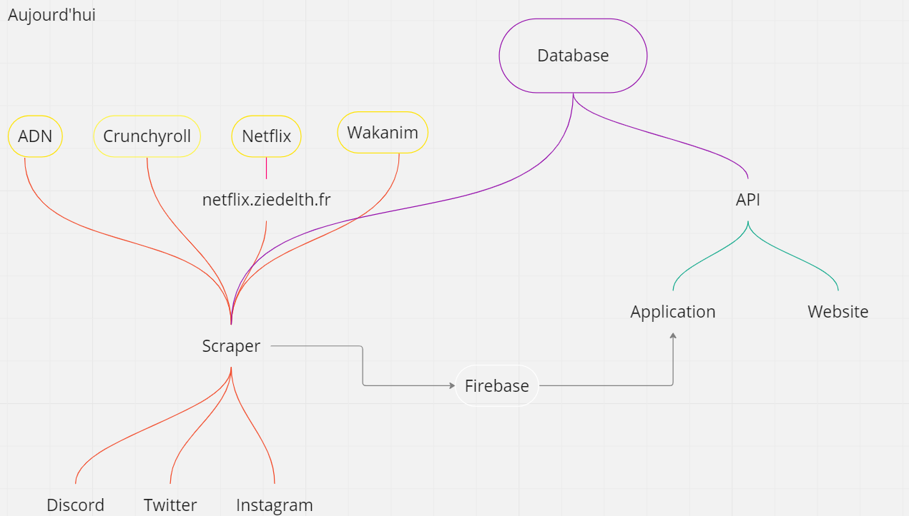

# Welcome to the Jaïs organization

Jaïs is a open source project that aims to collect all anime episodes available on platforms like ADN (Animation Digital Network), Crunchyroll, Netflix, Wakanim, etc. and make them available to the public.

## Today's structure

## Planned structure

